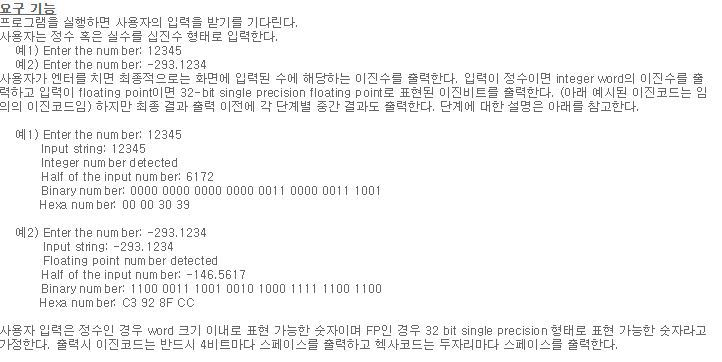
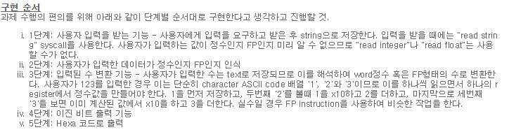

# MIPS_Assembly_Programming
Computer_Structure - MIPS_Assembly_Programming

<h2> Computer Structre </h2>  
<h3> Problem </h3> 

<h3> Solving </h3>
You must execute mars emulator.
Next, you load "2013013017.c" source on your mars emulator.

